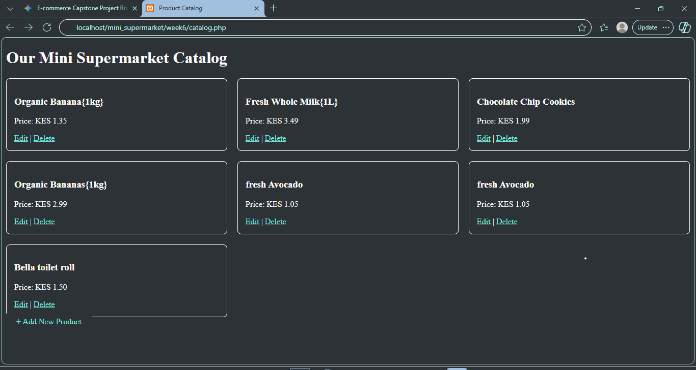

# Smart E-Commerce Web Application - Mini Supermarket

### 🎓 Project Overview
This is a full-stack e-commerce web application developed as part of the BIT3208: Advanced Web Design curriculum.

* **Student Registration No:** bbit/2024/74407
* **Lecturer:** Michael Nyoro

---

### 🛠️ Tech Stack
* **Frontend:** HTML5, CSS3
* **Backend:** PHP
* **Database:** MySQL
* **Tools:** XAMPP, VS Code

---

### 🚀 Key Features
* **User Authentication:** Secure admin login system (`login.php`).
* **Product Management:** Full CRUD functionality for inventory control.
* **Database Driven:** Integrated with MySQL for persistent data storage.

---

## Project Documentation

### Database Structure

### Product Catalog Interface
